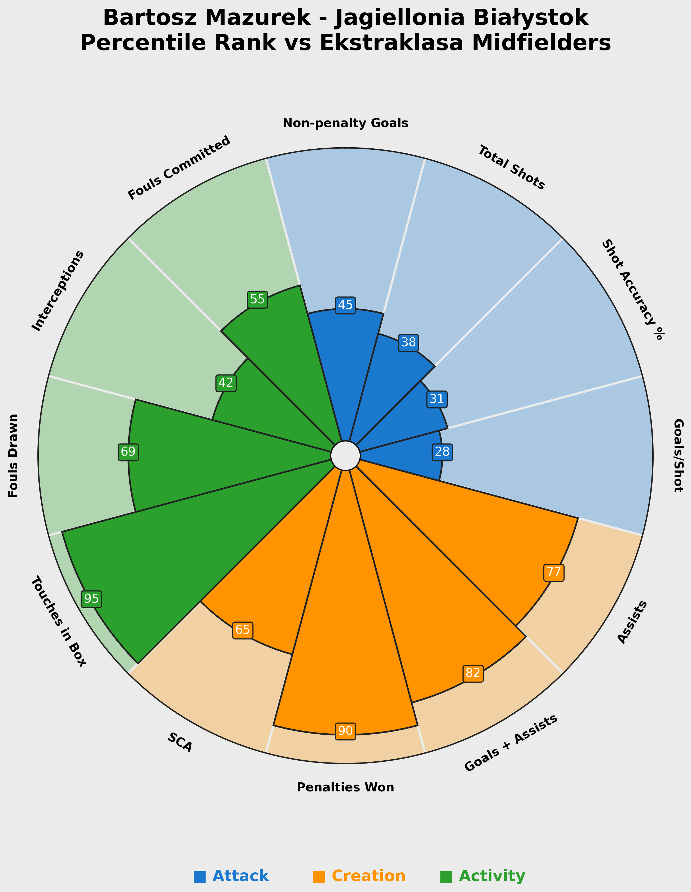

# Analiza profilu: Mazurek (Jagiellonia Białystok)

## 📊 Wykres-pizza

Poniższy wykres przedstawia percentyle Mazurka na tle innych pomocników w Ekstraklasie w sezonie 2025/26.

---

## 🔵 Statystyki strzeleckie

| Parametr | Percentyl | Interpretacja |
|----------|-----------|---------------|
| Non-penalty Goals | 45 | Średni wynik – Mazurek nie jest głównym egzekutorem, ale potrafi zdobyć bramkę z gry. |
| Total Shots | 38 | Oddaje mniej strzałów niż przeciętny pomocnik – raczej wybiera jakość nad ilością. |
| Shot Accuracy % | 31 | **Słaby wynik** – celność strzałów jest poniżej średniej ligowej. Obszar do poprawy. |
| Goals/Shot | 28 | Niska skuteczność – potrzebuje więcej sytuacji, żeby zdobyć gola. |

**Wniosek:** Mazurek nie jest typowym strzelcem. Jego atuty leżą gdzie indziej.

---

## 🟠 Statystyki kreatywne

| Parametr | Percentyl | Interpretacja |
|----------|-----------|---------------|
| Assists | 77 | **Bardzo dobry wynik** – Mazurek potrafi wypracować sytuacje kolegom. |
| Goals + Assists | 82 | **Świetny wynik** – łączy zdobywanie goli z asystami. |
| Penalties Won | 90 | **Elitarny poziom** – często wchodzi w pole karne i wymusza faule. |
| SCA (Shot-Creating Actions) | 65 | Powyżej średniej – tworzy sytuacje bramkowe dla zespołu. |

**Wniosek:** Kreatywność to największa siła Mazurka. Jest zawodnikiem, który potrafi zrobić różnicę w ofensywie.

---

## 🟢 Statystyki defensywne

| Parametr | Percentyl | Interpretacja |
|----------|-----------|---------------|
| Touches in Box | 95 | **Elitarny poziom** – bardzo często pojawia się w polu karnym rywala. |
| Fouls Drawn | 69 | Powyżej średniej – często faulowany, co daje zespołowi stałe fragmenty. |
| Interceptions | 42 | Nieco poniżej średniej – mniej aktywny w czytaniu gry defensywnej. |
| Fouls Committed | 55 | Średni wynik – popełnia tyle samo fauli co przeciętny pomocnik. |

**Wniosek:** Mazurek to zawodnik ofensywny, który spędza dużo czasu w polu karnym rywala. Defensywnie jest raczej przeciętny.

---

## 🎯 Podsumowanie profilu

### ✅ Mocne strony:
- **Kreatywność** – wysokie asysty (77%), SCA (65%) i wygrane karne (90%)
- **Obecność w polu karnym** – 95 percentyl w Touches in Box
- **Łączenie goli z asystami** – 82 percentyl w Goals + Assists

### ⚠️ Obszary do poprawy:
- **Skuteczność strzelecka** – niska celność strzałów (31%) i Goals/Shot (28%)
- **Defensywa** – intercepcje poniżej średniej (42%)

### 🏟️ Rekomendacja

Mazurek to **kreatywny pomocnik ofensywny**, który najlepiej czuje się w polu karnym rywala.

**Pasuje do drużyn:**
- Grających ofensywnie, z dominacją piłki
- Potrzebujących pomocnika z ostatnim podaniem
- Stawiających na pressing i szybkie odzyskiwanie piłki

**Nie sprawdzi się w roli:**
- Defensywnego pomocnika
- Samotnego napastnika
- Drużyny grającej długimi piłkami

**Potencjał transferowy:** Średni – mocny w Ekstraklasie, ale potrzebuje poprawy skuteczności, żeby myśleć o silniejszej lidze.

---

## 📝 Wnioski w pigułce

| ✅ Top 3 atuty | ⚠️ Do poprawy |
|----------------|---------------|
| 1. Touches in Box (95%) | 1. Shot Accuracy % (31%) |
| 2. Penalties Won (90%) | 2. Goals/Shot (28%) |
| 3. Goals + Assists (82%) | 3. Interceptions (42%) |

---

## 🔗 Źródło danych

Dane pochodzą z **FBref.com** i obejmują sezon 2025/26 Ekstraklasy.

---

## 👤 O autorze

Projekt wykonany w ramach portfolio analitycznego.

📧 Kontakt: [Twój email]  
🔗 LinkedIn: [Link do Twojego profilu]
