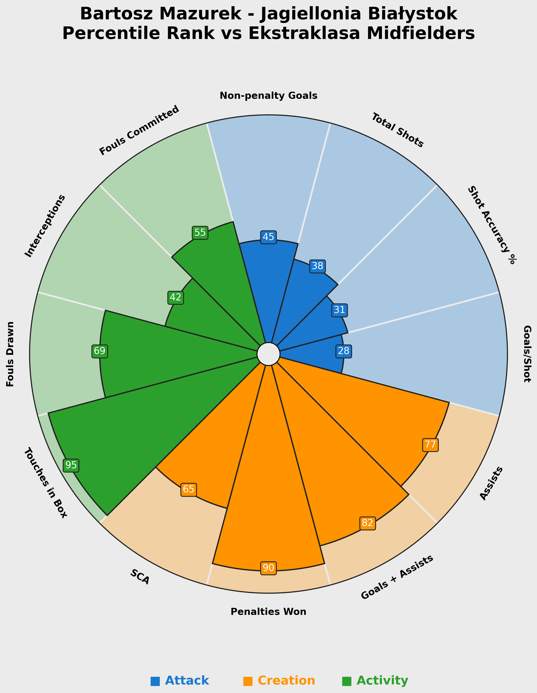
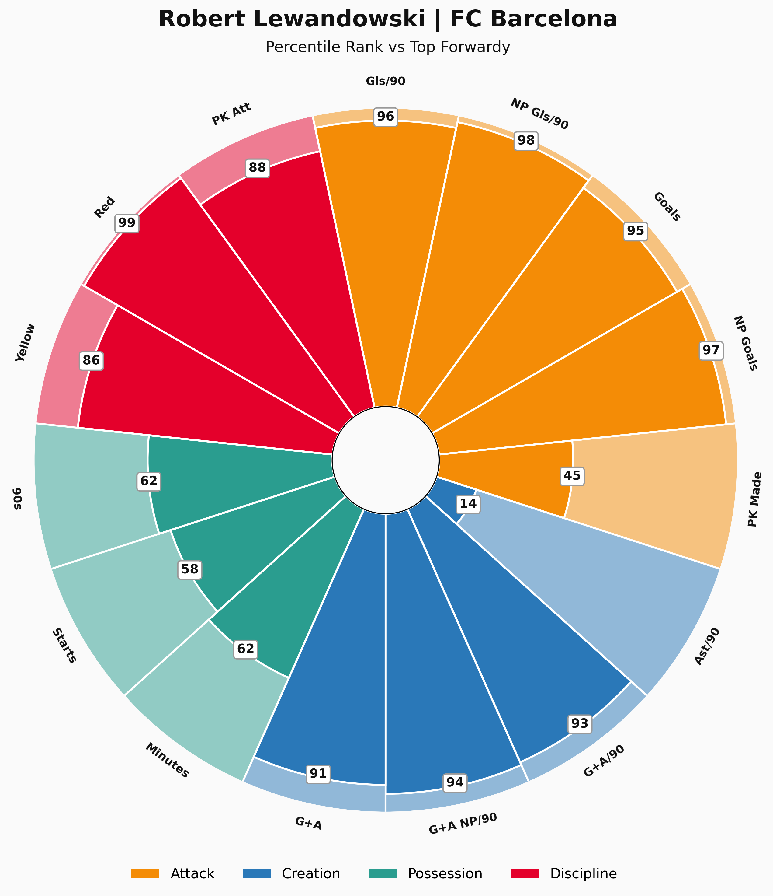
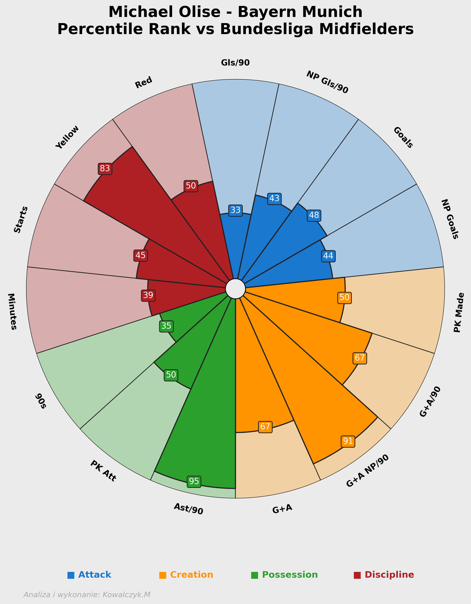

# Football Players Pizza Chart Analysis

## Mazurek

Mazurek is known for his excellent dribbling skills and agility on the field. The pizza chart shows his performance metrics, emphasizing his strengths in key areas.

## Lewandowski

Robert Lewandowski is one of the most prolific finishers in football history. His pizza chart indicates outstanding performance in goal-scoring and positioning.

## Olise

Michael Olise, a rising star, showcases his creativity and playmaking abilities in his pizza chart. The analysis reflects his contributions to the team's offensive strategies.
